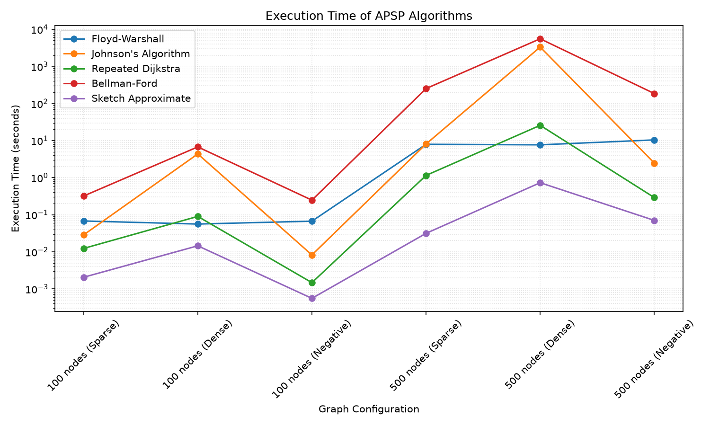

# APSP Algorithms

Five ways to solve the all-pairs shortest path problem: given a weighted graph,
find the shortest distance between every pair of vertices. Four are exact, one
trades accuracy for speed.

No single algorithm wins outright. Each owns a different corner of the input
space, and the benchmark here is mostly about finding where the boundaries
actually fall, which turned out to be harder than I expected.

Graduate coursework. Pure Python, nothing outside the standard library except
matplotlib for the plot.

## What's in here

```
graph.py              Graph class (edge list + adjacency map) and the random graph generators
algorithms/
  floyd_warshall.py   Floyd-Warshall
  johnson.py          Johnson's algorithm
  dijkstra.py         Dijkstra, and repeated Dijkstra for APSP
  bellman_ford.py     Bellman-Ford, and repeated Bellman-Ford for APSP
  sketch.py           Sketch-based approximation using random pivots
benchmark.py          Timing harness and plot generation
```

`Graph` keeps every edge twice, once in a flat `(u, v, w)` list and once in an
adjacency map. Bellman-Ford and Floyd-Warshall sweep the whole edge list;
Dijkstra expands one vertex at a time and wants the adjacency map. Storing both
means neither has to convert anything at run time.

## The five algorithms

Throughout, n is the vertex count and m the edge count.

**Floyd-Warshall** (`floyd_warshall`) fills a distance matrix by dynamic
programming. After iteration `k`, `dist[i][j]` holds the shortest path from `i`
to `j` that uses only vertices `0..k` as waypoints, so each new `k` asks a single
question per pair: is routing through `k` cheaper than what we have? After the
last `k` every vertex is allowed as a waypoint and the matrix is exact. It costs
O(n³) and O(n²) space regardless of how many edges exist. Density is free. That
same indifference to m is why it wastes so much effort on sparse graphs, where it
pays for n² pairs that mostly have no edge between them. It handles negative
edges but will not tell you about a negative cycle.

**Johnson's** (`johnson`) is built to beat repeated Bellman-Ford on sparse graphs
that have negative weights. It bolts on a virtual vertex connected to everything
at zero cost, runs one Bellman-Ford pass from it to get a potential `h`, then
reweights every edge to `w'(u,v) = w(u,v) + h[u] - h[v]`. The triangle inequality
guarantees every `w'` comes out non-negative, and since the `h` terms telescope
along a path, every route from `u` to `v` shifts by the same constant. The
shortest path is therefore unchanged, Dijkstra becomes legal, and subtracting the
shift at the end restores the true distances. O(n² log n + n·m) with a binary
heap. Returns `"Negative cycle detected"` when one exists.

**Repeated Dijkstra** (`all_pairs_dijkstra`) just runs Dijkstra from every
vertex, O(n · (m + n log n)). A binary heap serves as the priority queue, and
because `heapq` has no decrease-key, an improved vertex gets pushed again rather
than updated in place, with stale copies discarded on pop. It wins the sparse
regime here by 5.7x to 6.9x over Floyd-Warshall. It also turned out not to be
textbook Dijkstra at all, which is [finding 5](#the-dijkstra-here-isnt-textbook-dijkstra).

**Repeated Bellman-Ford** (`all_pairs_bellman_ford`) runs Bellman-Ford from every
vertex at O(n² · m). Each run relaxes all m edges n−1 times, which is the most
rounds any simple path can need, then does one extra sweep as a negative-cycle
test. It wins nothing on speed. It is here as the baseline Johnson's algorithm
was invented to replace, and it does that job well: the gap between them is the
whole point of Johnson's existing.

**The sketch** (`sketch_approx_apsp`, k=5 by default) is the only approximation
and the only one that never builds an n × n matrix. It samples `k` random pivots
and runs Dijkstra twice per pivot, once forwards for `d(p → v)` and once on the
reversed graph for `d(v → p)`. Every vertex keeps both numbers per pivot, and a
query estimates `d(u,v)` as the cheapest detour through a pivot the two share,
`min over p of d(u → p) + d(p → v)`. That's the distance-oracle idea from the
Thorup-Zwick line of work. Since each leg runs in the direction it actually
points, the estimate always describes a real walk, so it is a genuine upper
bound: never too small, sometimes too large, and `INF` exactly when no sampled
pivot sits on a path between the pair. Preprocessing is
O(k · (m + n log n)) and each query is O(k²). Two Dijkstra runs per pivot is a
constant factor, not a change in order. On a 40-vertex directed test graph it
returns the exact distance for 90% of pairs at k = 5 and 98% at k = 20.

| Algorithm | Time | Negative weights | Best regime |
|---|---|---|---|
| Floyd-Warshall | O(n³) | Yes, no cycle detection | Dense, small-to-medium n |
| Johnson's | O(n² log n + n·m) | Yes, with detection | Sparse with negative weights |
| Repeated Dijkstra | O(n · (m + n log n)) | Yes here † | Sparse, non-negative weights |
| Repeated Bellman-Ford | O(n² · m) | Yes, with detection | Simplicity and detection only |
| Sketch approximation | O(k · (m + n log n)) | Yes here † | Very large graphs, approximate answers |

† That's a property of this implementation, not of Dijkstra's algorithm. It omits
the settled set, so it is label-correcting: correct without negative cycles, but
without the O(m log n) bound. See
[finding 5](#the-dijkstra-here-isnt-textbook-dijkstra).

## Running the benchmark

```bash
pip install -r requirements.txt
python benchmark.py
```

That's the quick sweep and it takes a little over a minute. Sizes 50, 100 and 150
across three regimes, nine configurations total. Three points per regime is
enough to see the growth curves instead of isolated dots. The plot lands in
`results/apsp_benchmark.png` and nothing opens a window, so it works fine
headless.

For the original coursework sizes of 100 and 500:

```bash
python benchmark.py --full
```

Be warned that this takes hours, not minutes, and the numbers in
[Results](#results) come from it. Nearly all of that time goes into one cell.
On the 500-node dense graph, Bellman-Ford's O(n²·m) and Johnson's O(m²)
reweighting both run headlong into 249,500 edge entries, and Bellman-Ford alone
sits there for over an hour. Cost climbs steeply with n in the dense regime
because the dense generator makes m itself quadratic: between the quick sweep's
largest cell and the full sweep's, n grows 3.3x while Bellman-Ford's time grows
roughly 200x.

Other options:

```
python benchmark.py --sizes 100 200 300      # any sizes you like
python benchmark.py -a dijkstra -a sketch    # only some algorithms (repeatable)
python benchmark.py --no-negative            # skip the negative-weight configs
python benchmark.py --seed 42                # reproducible graphs
python benchmark.py -o results/run.png       # choose the output path
python benchmark.py -p 0.10                  # denser "sparse" graphs
python benchmark.py --help                   # all options
```

`--sizes` and `--full` are mutually exclusive. `--sizes` takes any vertex counts,
so it's the general escape hatch in both directions.

You need Python 3.7+ and matplotlib. The matplotlib dependency is only for the
plot; `graph.py` and everything under `algorithms/` is pure standard library.

### How the graphs are built

Every size runs in three regimes, so a sweep of k sizes is 3k configurations.

| Regime | Directed? | Weights | Edge entries at n | Generator |
|---|---|---|---|---|
| Sparse | undirected | 1…10 | ≈ p·n·(n−1) | `generate_sparse_graph(n)`, p = 0.05 |
| Dense | undirected | 1…10 | n·(n−1) | `generate_dense_graph(n)` |
| Negative | directed | −5…10 | ≈ p·n·(n−1)/2 | `generate_negative_weight_graph(n)`, p = 0.05 |

Sparse graphs include each candidate edge with probability 0.05 and dense graphs
include all of them. Both are undirected, stored as two directed entries per
connection, so "edge entries" is twice the number of distinct connections. That
works out to ~500 and 9,900 entries at n = 100, and ~12,400 and 249,500 at
n = 500, which makes the dense 500-node graph 20x the sparse one, exactly 1/p.
The negative graphs are sparser still, ~250 entries at n = 100 and ~6,200 at
n = 500, because they store one direction only.

The negative configurations are there because the other two never justify why
Johnson's and Bellman-Ford are in this repo at all. With non-negative weights a
plain Dijkstra is always available and always faster, so anything that pays extra
to tolerate negative edges can only lose.

Those graphs are directed on purpose, and the reason is worth spelling out. An
undirected edge of weight −3 can be walked in both directions, which makes it a
cycle of weight −6 all by itself. So every undirected graph carrying any negative
weight has a negative cycle, and Johnson's and Bellman-Ford would detect it and
return immediately, measuring nothing. Emitting edges only from lower to higher
vertex IDs makes the graph acyclic by construction, and shortest paths stay well
defined at any weight range.

Each algorithm is timed once per configuration, with `time.time()` around a
single run.

## Results

Measured with `python benchmark.py --full --seed 1` on Python 3.11, in seconds.
The sweep took 1 h 53 m. Every cell is measured; nothing is extrapolated.

| Algorithm | 100 sparse | 100 dense | 100 negative | 500 sparse | 500 dense | 500 negative |
|---|---|---|---|---|---|---|
| Floyd-Warshall | 0.068 | **0.056** | 0.067 | 7.922 | **7.664** | 10.401 |
| Johnson's | 0.029 | 4.354 | **0.008** | 8.078 | 3318.876 | 2.467 |
| Repeated Dijkstra | **0.012** | 0.090 | **0.001** | **1.147** | 25.724 | **0.290** |
| Repeated Bellman-Ford | 0.319 | 6.738 | 0.247 | 252.290 | 5553.765 | 185.007 |
| Sketch approximation | 0.002 | 0.014 | 0.001 | 0.031 | 0.729 | 0.070 |

Bold marks the fastest exact algorithm in each column. The sketch is left out of
that comparison because it only measures preprocessing, for reasons covered in
[Caveats](#caveats).



Log scale, because the algorithms span five orders of magnitude. Floyd-Warshall
is the flat line. Everything else spikes on the dense configurations.

## What I found

### The textbook regime split holds, and I nearly published the opposite

Each algorithm wins where the textbook says it should:

| n = 500 | Floyd-Warshall | Repeated Dijkstra | Winner |
|---|---|---|---|
| sparse (12,358 entries) | 7.922 | 1.147 | Dijkstra, 6.9x |
| dense (249,500 entries) | 7.664 | 25.724 | Floyd-Warshall, 3.4x |

The asymptotics explain it. Repeated Dijkstra is O(n·(m + n log n)), so its cost
rides on m, while Floyd-Warshall is O(n³) and ignores m completely. On the sparse
graph m ≈ 25n and Dijkstra wins comfortably. On the dense graph m ≈ n², both
collapse to O(n³), and the constant factor decides: a flat triple loop over a
preallocated matrix beats n heap-driven searches with all their pushes, pops and
staleness checks. There's no crossover hiding at smaller sizes either. The quick
sweep puts Floyd-Warshall ahead in the dense regime at n = 50, 100 and 150 too,
by a consistent 1.6x or so.

Here's the part I actually want to record. An earlier version of this repo
reported the exact opposite, with repeated Dijkstra beating Floyd-Warshall 4.6x
on the 500-node dense graph. I had a tidy explanation ready about interpreted
Python constant factors, and I believed it.

It was a bug in the graph generators. They emitted edges only for `u < v`, so
every graph was really a DAG where a search starting at vertex `u` could only
ever reach vertices numbered above it. Each Dijkstra run explored half the graph
on average, and runs from high-numbered vertices were nearly free, while
Floyd-Warshall's n³ loop paid full price no matter what. Making the graphs
genuinely undirected took that discount away, and Dijkstra's 500-node dense time
went from 2.198 s to 25.724 s. An 11.7x jump on a graph with only twice as many
edges.

What bothers me is why it survived so long. The wrong number looked interesting.
An inverted textbook claim invites you to explain it rather than doubt it, and
the explanation I came up with was perfectly reasonable on its own terms. Nothing
about the measurement itself looked broken. I only caught it because fixing an
unrelated bug in the generators moved the number.

### Floyd-Warshall really doesn't care how many edges there are

This is the cleanest result in the sweep, and the only headline that came through
the generator fix untouched. Going from 500 sparse to 500 dense multiplies the
edge count by 20.2x, and Floyd-Warshall goes from 7.922 s to 7.664 s. It gets 3%
faster, which is just noise around a flat line.

Putting Bellman-Ford next to it on the identical pair of graphs makes the
contrast obvious:

| 500 sparse → 500 dense | Time | Growth |
|---|---|---|
| Edge entries | 12,358 → 249,500 | 20.2x |
| Floyd-Warshall | 7.922 → 7.664 | 0.97x |
| Repeated Bellman-Ford | 252.290 → 5553.765 | 22.0x |

Bellman-Ford's 22.0x against an edge growth of 20.2x tracks its O(n²·m) bound
almost exactly. Floyd-Warshall is the only algorithm here whose cost you can
predict from the vertex count alone, which is exactly what makes it dependable on
dense input and wasteful on sparse input.

### Johnson's is slow here because of my Graph class, not because of Johnson

Johnson's takes 3318.876 s on the 500-node dense graph. That's 55 minutes, and
129x slower than the repeated Dijkstra it is built on top of. Since Johnson's is
one Bellman-Ford pass plus n Dijkstra runs, and those n runs cost 25.724 s by
themselves, essentially the entire runtime is overhead.

The culprit is `Graph.update_edge_weight`, which scans the whole edge list on
every single call. Reweighting all m edges therefore costs O(m²), which at
249,500 entries is 6.2 × 10¹⁰ operations. The negative configuration confirms it:
that graph has only 6,216 entries, so an m² model predicts a 1,611x reduction,
and the measured drop is 1,345x (3318.876 s down to 2.467 s). For a prediction
spanning three decades, landing that close is convincing.

Indexing the edge list by `(u, v)` would take this to O(m) and put Johnson's back
in line with its O(n² log n + n·m) bound. I left it alone on purpose, since the
brief was to preserve the original implementations.

### Johnson's earns its keep once weights go negative

On the negative configurations Johnson's beats repeated Bellman-Ford by 75x at
n = 500 (2.467 s against 185.007 s) and by 31x at n = 100. That is precisely the
comparison the algorithm was designed to win, and my original non-negative-only
benchmark had no way to show it.

The reason is structural. Johnson's does one O(n·m) Bellman-Ford pass to compute
potentials and then n cheap Dijkstra runs, where repeated Bellman-Ford does n
expensive Bellman-Ford runs. The saving grows with n, which is why the margin
more than doubles between n = 100 and n = 500.

So the dense column shouldn't be read as "Johnson's is slow." In that column it
is paying for a capability the input doesn't need. Measure any algorithm outside
the regime it was designed for and it will lose to something simpler, and that
says more about the benchmark than the algorithm.

### The Dijkstra here isn't textbook Dijkstra

I found this while adding the negative-weight configurations. My implementation
keeps no settled or visited set. The `d > dist[u]` check only rejects stale heap
entries, not vertices that were already expanded, so a vertex whose distance
later improves gets pushed and expanded a second time. That makes it
label-correcting rather than true Dijkstra.

Which means it returns correct distances on graphs with negative edges, as long
as there's no negative cycle. I checked it against Floyd-Warshall on 25 random
negative-weight graphs with zero disagreements, and on the standard counterexample
where textbook Dijkstra falls over:

```
0 →1 (w=2), 0 →2 (w=5), 1 →2 (w=-4)     true d(0,2) = -2
settled-set Dijkstra: 5 (wrong, finalises vertex 2 before the shortcut)
this implementation: -2 (correct, re-expands vertex 2)
```

That's why the benchmark runs all five algorithms on the negative configurations
instead of skipping the two built on Dijkstra. The tolerance isn't free, though.
The O(m log n) bound assumes each vertex is expanded once, and negative edges
break that assumption. Re-expansions stay cheap on these acyclic graphs, but the
worst case is exponential.

## Caveats

A few things to know before reading too much into the numbers.

The negative-weight graphs are directed, so they have unreachable pairs.
`generate_negative_weight_graph` emits edges only for `u < v` to stay acyclic,
which leaves roughly half of all vertex pairs with no path at all and a distance
of `INF`. The sparse and dense generators are undirected and don't behave this
way. So the negative column isn't directly comparable to the other two: it's a
different graph shape, not just a different weight range.

`johnson()` reweights its input in place and returns with the graph's weights
still in reweighted form. The benchmark shares one graph object across all five
algorithms in a configuration, the way the original notebook did, so the three
that run after Johnson's see the reweighted graph. Reweighting preserves
shortest-path structure, so the timings are still valid, but pass `graph.copy()`
if you need the original weights back.

The sketch timing covers preprocessing only. `sketch_approx_apsp` returns a query
function, so timing the call captures the Dijkstra runs and none of the
O(k²)-per-pair query cost. Those numbers aren't comparable like-for-like against
the four algorithms that build a full matrix.

The sketch estimate is an upper bound and never an underestimate, though it
didn't start that way. It originally stored only from-pivot distances and
estimated `d(p → u) + d(p → v)`, which describes a real walk from `u` to `v` only
on undirected graphs. On directed input it happily returned finite distances for
pairs with no path between them. It now stores `d(u → p)` alongside `d(p → v)` so
both legs run in the direction they point.

Every cell is a single unrepeated measurement, so the sub-millisecond entries sit
close to timer noise. Trust the order-of-magnitude gaps. Don't trust the small
differences.
